# Reeborg's World  
  
[https://reeborg.ca/](https://reeborg.ca/)  
  
  
  
## Home 4  
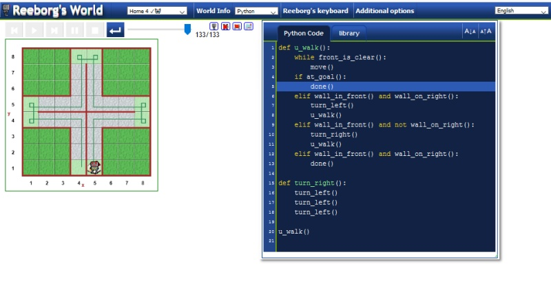  
  
***
## Around 1  
```py
turns = 0

def u_walk():
    global turns
    while front_is_clear() and turns < 4:
        move()
        if wall_in_front():
            turn_left()
            turns += 1
            print("Turned ", turns, " times")
            u_walk()
    done()  

u_walk()
```
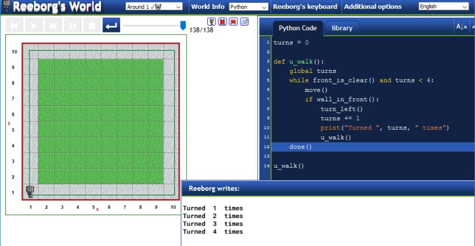  
  
## Around 1 - Apple  
```py
turns = 0
  
def u_walk():
    global turns
    if object_here():
        take()
        u_walk()
    if wall_in_front():
        if turns == 3:
            done()
        turn_left()
        turns += 1
        u_walk()
    else:
        move()
        u_walk()
        
u_walk()
```
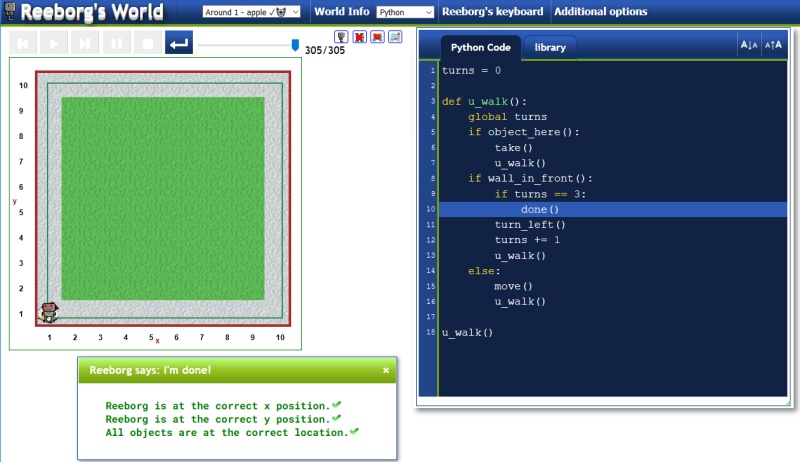  
  
## Around 2  
```py
turns = 0
steps = 0
def go_right():
    repeat 3:
        turn_left()
def u_walk():
    global turns, steps
    while wall_on_right() and front_is_clear():
        move()
        steps +=1
        print(steps)
    if not wall_on_right():
        go_right()
        move()
        steps += 1
        turns += 1
    if not front_is_clear():
        turn_left()
        turns += 1
    if steps > 35:
        done()
    u_walk()
u_walk()
```
  
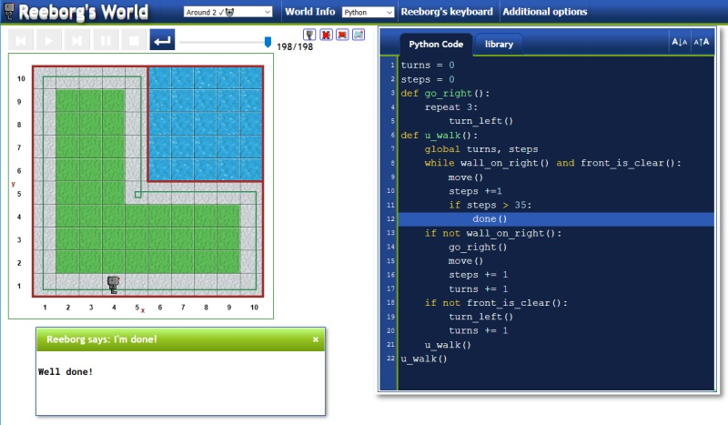  
  
## Around 3  
```py
def turn_right():
    repeat 3:
        turn_left()

def u_walk():
    if not wall_on_right():
        turn_right()
        move()
    elif front_is_clear():
        move()
    else:
        turn_left()
 
put()
turn_left()
move()
while not object_here():
    u_walk()
take()
```
  
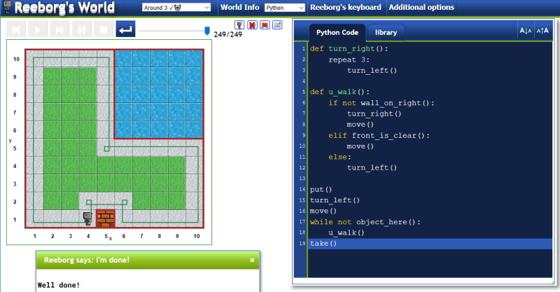  
  
## Around 4  
```py
steps = 0
def turn_right():
    repeat 3:
        turn_left()
def u_walk():
    global steps
    if not wall_on_right():
        turn_right()
        move()
        steps += 1
    elif front_is_clear():
        move()
        steps += 1
    else:
        turn_left()

put()
while not object_here() or steps < 10 :
    u_walk()
print(steps)
take()
```
  
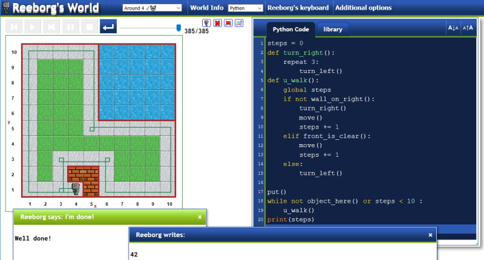  
  
***
## Harvest 2  
```py
def go_right():
    repeat 3:
        turn_left()
def right_turn():
    repeat 2:
        go_right()
        move()
def left_turn():
    repeat 2:
        turn_left()
        move()
def take_row():
    repeat 6:
        while object_here():
            take()
        move()
def harvest():
    repeat 3:
        take_row()
        right_turn()
        take_row()
        left_turn()
move()
move()
turn_left()
move()
move()
harvest()
```
  
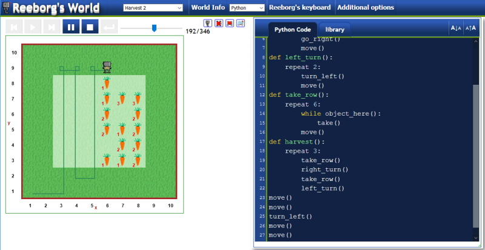  
  
***
## Center 1  
```py
width = 1
def turn_around():
    turn_left()
    turn_left()
def to_the_end():
    global width
    while front_is_clear():
        move()
        width += 1
    turn_around()
def find_center():
    global width
    for i in range(width//2):
        move()
    put()
    done()
to_the_end()
find_center()
```
  
***
## Hurdle 1  
```py
turns = 0
steps = 0
def go_right():
    repeat 3:
        turn_left()
def u_walk():
    global turns, steps
    while wall_on_right() and front_is_clear():
        move()
        steps +=1
        if steps > 35:
            done()
    if not wall_on_right():
        go_right()
        move()
        steps += 1
        turns += 1
    if not front_is_clear():
        turn_left()
        turns += 1
    u_walk()
u_walk()
```
  
  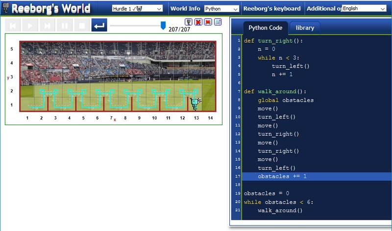  
  
## Hurdle 2  
```py
jumps = 0
def go_right():
    repeat 3:
        turn_left()
    move()
def go_left():
    turn_left()
    move()
def jump():
    move()
    go_left()
    go_right()
    go_right()
    if at_goal():
        done()
    turn_left()
    
repeat 6:
    jump()
```
  
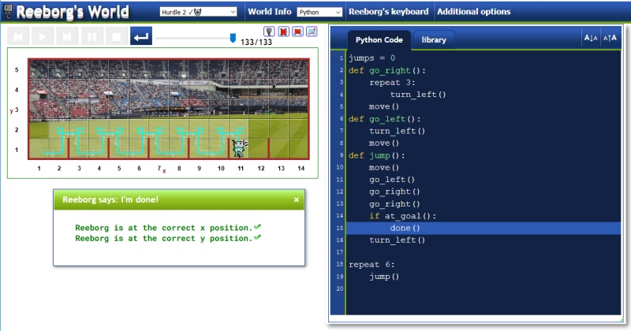  
  
## Hurdle 3  
```py
def turn_right():
    repeat 3:
        turn_left()
def jump():
    turn_left()
    move()
    repeat 2:
        turn_right()
        move()
    turn_left()
while not at_goal():
    if wall_in_front():
        jump()
    else:
        move()
```
  
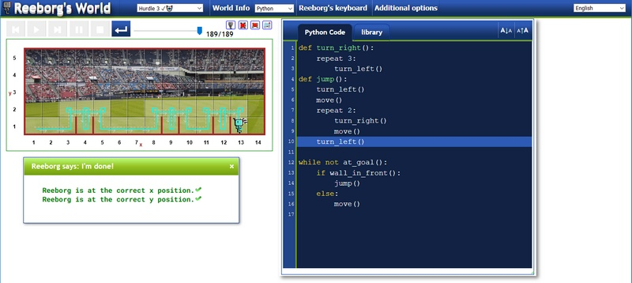  
  
## Hurdle 4  
```py
def turn_right():
    repeat 3:
        turn_left()
def jump():
    turn_left()
    while wall_on_right():
        move()
    repeat 2:
        turn_right()
        move()
    while front_is_clear():
        move()
    turn_left()
while not at_goal():
    if wall_in_front():
        jump()
    else:
        move()
```
  
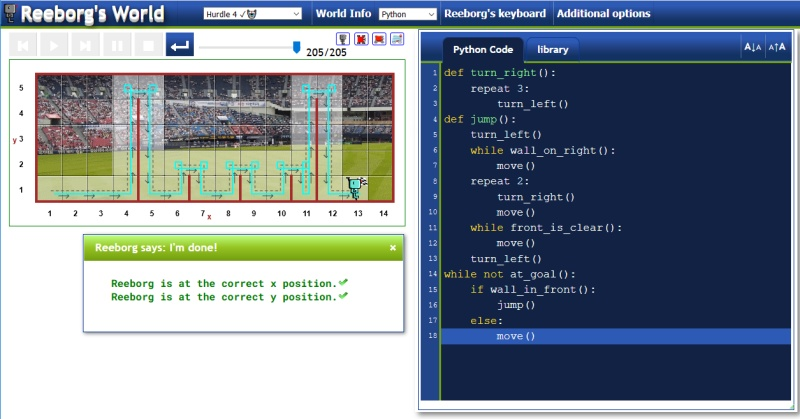  
  
***
## Maze  
```py
def turn_right():
    repeat 3:
        turn_left()
def u_walk():
    while not at_goal():
        if not wall_on_right():
            turn_right()
        if front_is_clear():
            move()
        else:
            turn_left()
u_walk()
```
  
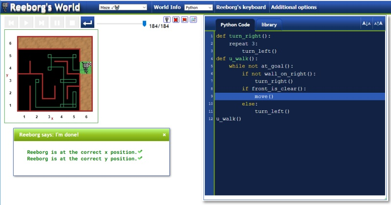  
  
***
## Newspaper 0  
```py
take()
def go_up():
    repeat 3:
        turn_left()
        move()
        repeat 3:
            turn_left()
        repeat 2:
            move()
def go_down():
    repeat 3:
        repeat 2:
            move()
        turn_left()
        move()
        repeat 3:
            turn_left()        
go_up()
put()
repeat 2:
    turn_left()
go_down()
```
  
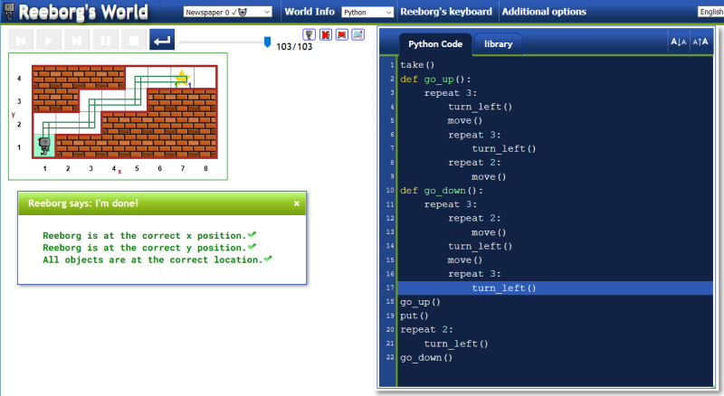  
  
## Newspaper 1  
```diff
while object_here("token"):
    take()
put("star")
```
  
***
## Tokens 4  
```py
smiles = 0
while not at_goal():
    global smiles
    if object_here():
        take()
        smiles += 1
        move()
        if not object_here():
            global smiles
            while smiles != 0:
                put()
                smiles -= 1
            move()
    else:
        move()
```
  
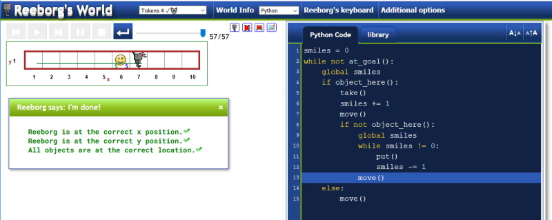  
  